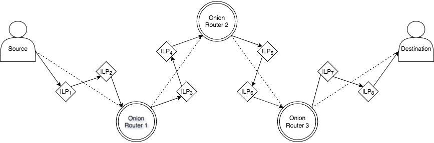
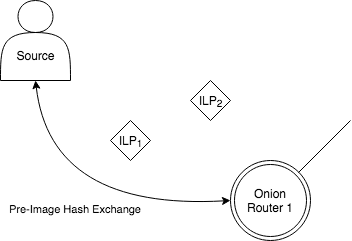
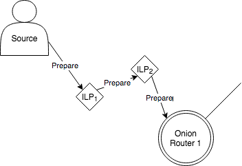
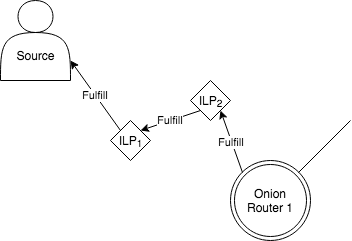

# ILP-CEPA Protocol

## Overview

ILP-CEPA is a protocol that uses onion routing as a network overlay to privately route execution conditions for off-chain ILP transactions. The original ILP protocol can be found [here](https://github.com/interledger).

## Phases

1. Source-Destination Setup
	- Choose *Destination* and amount to send
	- Pre-image Hash Exchange
	- *Source* Finds ILP path to *Destination*
2. Onion Routing Setup
	- Designate > 1 ILP nodes to act as Onion Routers (ORs)
	- Find pubkeys of each *OR* along the route
	- Establish ephemeral keys with each *OR*
3. Prepare
	- ...
4. Fulfill
	- ...

## Protocol Outline

A single onion routed hop represents over potentially several ILP hops.

Contingent upon how packets are constructed and the ultimate security guarantees we want to make, the protocol can proceed in two ways:

### Option A: An ILP Run per OR Hop

### Option B: Prepare and Fulfill Across Entire Network

## Threat Model

### Network Adversaries

The protocol makes the following assumptions on network adversaries:

- Off-route passive observers constantly monitor traffic from every on-route node.
- Every ILP node can retain message information for an indefinite amount of time.

### Security Guarantees

- Ephemeral Diffie–Hellman for forward secrecy
- ...

This protocol is **NOT** secure against timing analysis or *OR* collusion.

## Packet Structure

### Payload Construction

## Other Details

### Routing Protocols

### Pre-image Hash Exchange

### Onion Routing Ephemeral Key Generation