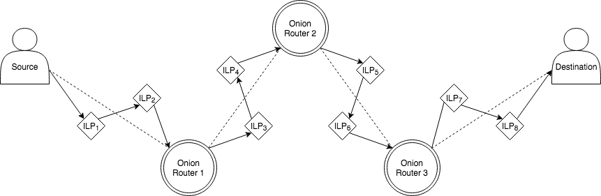
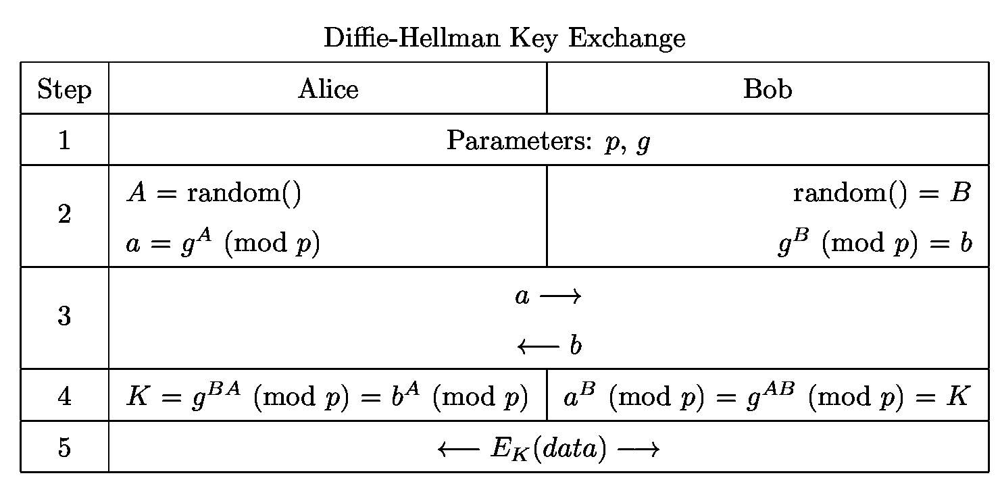
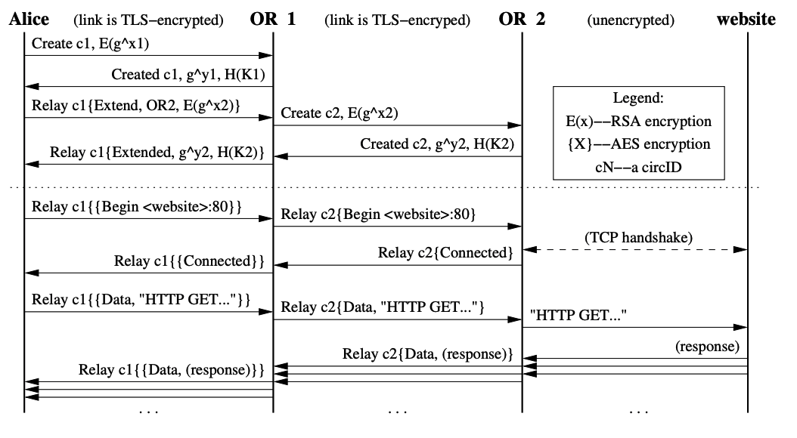

# Cepa - A protocol for private payments over the Interledger

## Overview

Cepa is a protocol that uses onion routing as a network overlay to privately route payments for off-chain Interledger transactions. The original set of details for the Interledger Protocol (ILP) can be found [here](https://github.com/interledger). The purpose of this protocol is to be able to make payments over ILP such that an on/off-path adversary would not be able to construct the exact interconnected graph of payment flow. This ensures a degree of anonymity and privacy equivalent to that of mix-nets. Our goal here is to optimize for the same guarntees offered by any mixnet construction, not necessarily through an optimal algorithm until the time comes for a production ready variant.

## Threat Model

### Network Adversaries

The protocol makes the following assumptions on network adversaries:

- Off-route passive observers constantly monitor traffic from every on-route node.
- On-route observers will only know the previous and next hops for their
  retrieved packet.
- Every ILP node can retain message information for an indefinite amount of time.
- ILP nodes may be controlled by adversaries, but it is statistically unlikely that all nodes along the path are controlled by the same adversary.

### Security

Our security metrics are based on the following:
- Participants in a route don't know their exact position within the route
- Participants within a route only know their neighbors, and cannot distinguish the sender of the payment, nor the receiver of the payment
- Participants within a route don't know how many participants were involved in the entire payment route
- At best, even the receiver would only know a throwaway wallet address from payment channel state, assuming the user has done best practices outside of the protocol.
- We use Ephemeral EC-Diffie–Hellman for forward secrecy so that if a connector is compromised it won't leak future counterparty information.

Optionally, if we have time:
Participants within a route don't even know that they are within a route, as the packet formats would be indistinguishable from that of vanilla ILP. That is to say, an ILP node running Onion Routing compatible software cannot tell whether the packets it is passing along Onion Routed packets or regular STREAM packets.

If we can prove this, that'd be pretty cool. The internet today, it's pretty obvious to tell that you're using TOR, just because the protocols are so different from, say, VPN protocols. But in this model, the traffic would be indistinguishable, even to an on path Onion Router.

This protocol is **NOT** secure against timing analysis or *OR* collusion.

## Phases Overview

1. Onion Routing Setup
 - Choose >1 ILP nodes to act as Onion Routers (ORs)
 - Find ILP addresses of each OR along the route.
 - Establish shared secrets with each OR.
2. Source-Destination Setup
	- Choose *Destination* and amount to send
	- Pre-image Hash Exchange
3. Routing
    Routing A:
    - Use this circuit as a VPN
    Routing B:
    - Use this circuit as a TOR relay
	- ...

## Protocol Outline
### 1. Routing Setup
 - Choose >1 ILP nodes to act as Onion Routers (ORs)
    - TOR does this with the help of a distributed directory service. However, this is a non-trivial problem, and it's hard to nail down exactly how to locate the directory, how to guarantee nodes can trust it, how new nodes can add/update/delete themselves from the directory, etc. and it's probably out of the scope of our project. Besides, it's not the interesting part of what we're working on anyways. For this project, we could hardcode a list of Onion-compatible nodes into each of the nodes, and not worry about designing a directory service.
 - Find ILP addresses and established shared secrets with each OR along the route.
    - You can get the ILP addresses from the hardcoded list as detailed above. To establish shared secrets, you need some sort of public key infrastructure, which Interledger doesn't have. Designing our own PKI with Interledger is out of the scope of our project, so it's not worth doing. Also, it's something Evan is personally working on.
    - Instead, we could just establish SPSP connections between the sender and each of the ORs, and run DHE key exchange over SPSP to establish shared keys. SPSP runs over HTTPS, so it leverages the PKI of the Internet. This means that a passive observer could see the traffic between the source and the ORs, and learn an unordered list of the ORs on the route, but defending against that would involve building custom PKI, which isn't worth us doing.

A single onion routed hop represents over potentially several ILP hops.

The protocol should support two kinds of interactions:

### Option A: ILP Over STREAM over ILP (VPN style)

1)  We establish a STREAM connection between Source and OR1, OR1 and OR2, OR_i and OR_i+1, and OR_n and Destination.
STREAM has a way to send arbitrary data and/or money over a connection.
(1) Source sends a packet over STREAM, where the data payload resembles an ILP prepare statement. This gets routed (over STREAM over ILP) to OR1.
(2) OR1 sends a prepare statement over STREAM over ILP to OR2. etc. etc.
(3) propagate fulfils backwards.
(4) resolve the money at eaach step.

### Option B: Onion-routing Over STREAM over ILP (TOR style)

Here, the sender is directly sending money/data to the destination.
The sender creates a payload which encodes this money/data.
The sender onion wraps this payload with the keys of all the ORs on the path.
The sender sends this payload over STREAM.
The Onion Routers unwrap and pass the message along until it reaches the destination.

## Packet Structure
We need to ensure that 'VPN' style packets are indistinguishable from TOR style packets. At the very least, this means padding to equal length, but it might involve more careful consideration. A good thing to add to our testing strategy would be setting up an adversary who intercepts both styles of packets, and tries to distinguish them based on various properties.

### Payload Construction

## Appendix

### Why not just run this all over onion routing

We wanted to set the grounds for a full privacy framework on Interledger and
we needed to have senders, receivers and connectors all involved on the same
networks. We see onion routing as a starting point for conducting private
payments over the Interledger.

## Protocol Details

#### 1. Onion Routing Setup

 - Choose >1 ILP nodes to act as Onion Routers (ORs)
	 - A centralized server (maybe just a key-value store exposing a REST endpoint) contains a mapping of nodes to ILP addresses for all Cepa-compatible nodes. 
	 - Server requests mapping from server, and picks >3 nodes at random to use as Onion Routers. 
 - Find ILP address of each OR along the route 
	 - Read off the values from the server's response
 - Establish shared secrets with each OR.
	 - Negotiate a symmetric key with each OR on the circuit using DHE
	  
	  To establish shared secrets with each OR without the circuit being discoverable to an adversary, the keys need to be established incrementally. 
	  
	  All the messages required to negotiate the keys will be sent by sending an ILP Prepare packet with a `StreamData` frame in the STREAM packet. All STREAM packets are encrypted using AES-256-GCM with a 12-byte Initialization Vector (IV) and a 16-Byte Authentication Tag.

	 - 
#### 2. Source-Destination Setup
- Choose *Destination* and amount to send
- Pre-image Hash Exchange
Both of these steps  can be done out of channel, in the same way ILP currently does it 
#### 3. Routing
##### Routing A:
   - Use this circuit as a VPN by sending ILP packets over STREAM 
   - 
##### Routing B:
   - Use this circuit as a TOR relay
   -  Sender has established ephemeral keys for OR node in the previous step. They can now wrap a message by incrementally encrypting it with each key. This wrapped message is sent to the first cepa node. This node will decrypt it (how does it know to decrypt it? Need some indicator that it's an onion packet), then forward it (how does it know where to forward it to? Needs some pointer to the next hop)
   - Destination receives original plaintext data. What is this data? Could be an ILP Prepare message to open a payment channel directly with the sender.

### Transaction model: 
Transactions don't need to be atomic under STREAM. Instead, payments are streamed as a series of micropayments. If a malicious connector steals money in the middle of the transaction, the sender will be alerted and can stop sending payments through that node, so that only a tiny amount of money is lost. The transaction can still complete through other routes. 
